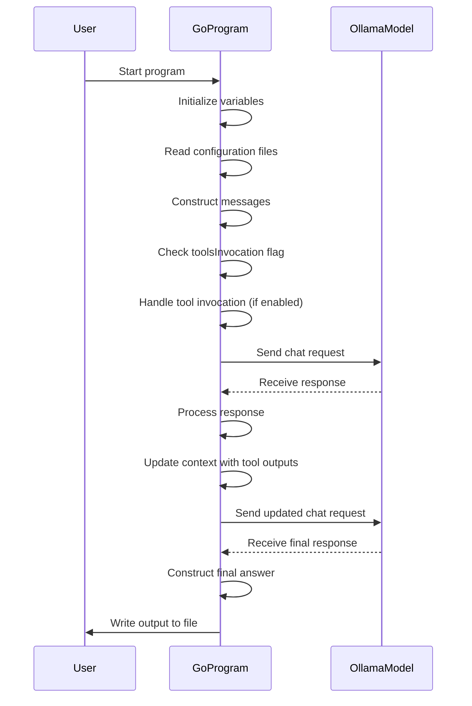
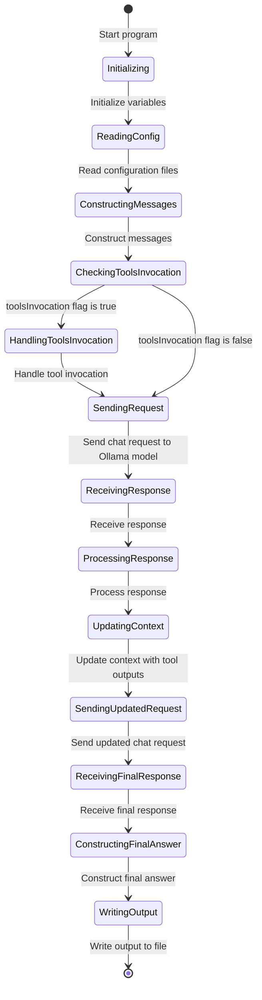

The provided code is a Go program that interacts with an Ollama language model to generate a response to a given prompt. Here's a detailed explanation of the code and the corresponding sequence and state Mermaid diagrams:

### Code Explanation

1. **Import Statements**:
   - The program imports necessary packages such as `context`, `log`, `os`, `exec`, `strings`, and custom packages `api` and `tools`.

2. **Main Function**:
   - The `main` function is the entry point of the program.
   - It defines several variables to store paths and configurations.

3. **Error Handling**:
   - The program uses `log.Fatalf` to handle errors and terminate execution if an error occurs.

4. **Reading Configuration Files**:
   - The program reads configuration files such as `tools.json` and `prompt.md` using `os.ReadFile`.

5. **Building Messages**:
   - The program constructs messages to be sent to the Ollama model. It includes system instructions and user input.

6. **Handling Tool Invocation**:
   - If the `toolsInvocation` flag is set, the program handles tool invocation:
     - Reads tool configurations.
     - Executes tools based on the response from the Ollama model.
     - Updates the context with the tool outputs.

7. **Sending Request to Ollama Model**:
   - The program sends a chat request to the Ollama model with the constructed messages and options.

8. **Processing Response**:
   - The program processes the response from the Ollama model, appending the content to the `answer` string.

9. **Writing Output**:
   - The program writes the final response to an output file specified by `config.OutputPath`.

### Sequence Diagram

### State Diagram

These diagrams provide a visual representation of the sequence of events and the state transitions within the program.