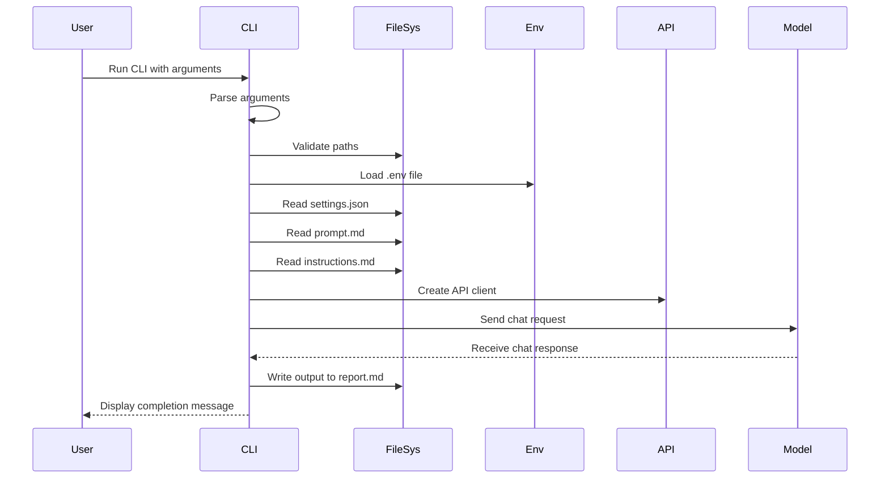
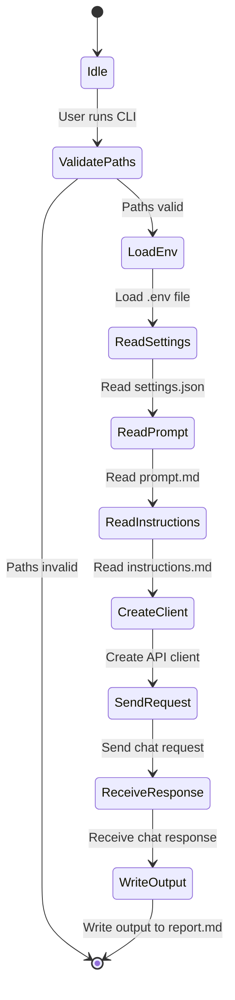

### Explanation of the Code

The provided Go code is a command-line tool that interacts with an AI model via an API to generate a report based on a prompt and settings. Here's a breakdown of the code:

1. **Imports and Configuration**:
   - The code imports necessary packages for file handling, HTTP requests, JSON parsing, and environment variable management.
   - It defines a `Config` struct to hold paths for the prompt file, settings directory, and output file.

2. **Path Validation**:
   - The `validatePaths` function checks if the prompt file, settings directory, and output directory exist and are correctly configured.

3. **Command-Line Flags**:
   - The code uses the `flag` package to define command-line flags for the prompt path, settings path, output path, and a version flag.

4. **Main Logic**:
   - The `main` function initializes the configuration and parses command-line arguments.
   - It checks if the version flag is set and prints the version information if so.
   - It validates the required paths and loads environment variables from a `.env` file in the settings directory.
   - It reads the model configuration from a `settings.json` file and constructs a prompt using a `prompt.md` file and `instructions.md` file.
   - It sends a chat request to the AI model using the `api.NewClient` and processes the response to generate a report.
   - Finally, it writes the generated report to the specified output file.

### Sequence Diagram

### State Diagram

### Syntax Check

Both the sequence and state diagrams are syntactically correct for Mermaid. You can use any Mermaid live editor to visualize these diagrams.