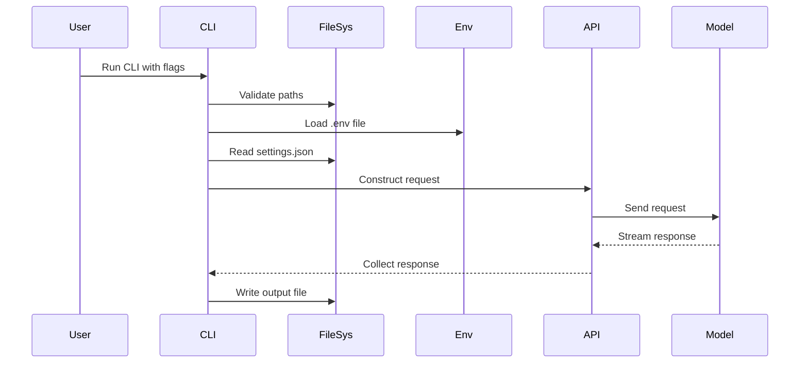
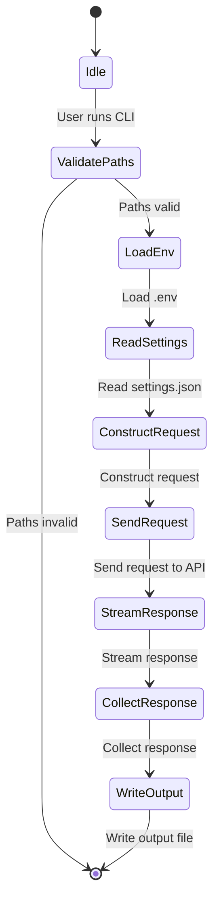

### Explanation of the Code

The provided Go code is a command-line tool that interacts with an AI model via an API to generate a report based on a prompt and settings. Here's a breakdown of the code:

1. **Imports and Configuration**:
   - The code imports necessary packages for file handling, HTTP requests, JSON parsing, and environment variable management.
   - It defines a `Config` struct to hold paths for the prompt file, settings directory, and output file.

2. **Path Validation**:
   - The `validatePaths` function checks if the prompt file, settings directory, and output directory exist and are correctly configured.

3. **Command-Line Flags**:
   - The code uses the `flag` package to define command-line flags for specifying paths and a version flag.

4. **Version Handling**:
   - If the version flag is set, the code prints the version information from an embedded file and exits.

5. **Path Validation**:
   - The code checks if the required paths are provided and valid.

6. **Environment and Configuration Loading**:
   - The code loads environment variables from a `.env` file in the settings directory.
   - It reads a JSON configuration file for model settings.

7. **API Interaction**:
   - The code constructs a request to the AI model API with the prompt and instructions.
   - It sends the request and streams the response, appending each chunk to the answer string.

8. **Output Generation**:
   - The final answer is written to the specified output file as a Markdown document.

### Mermaid Diagrams

Below are the Mermaid diagrams representing the flow of the code:

#### Sequence Diagram



#### Class Diagram

```mermaid
classDiagram
    class Config {
        +string PromptPath
        +string SettingsPath
        +string OutputPath
    }

    class main {
        +main()
        +validatePaths(Config) error
    }

    class api {
        +NewClient(url, http.Client) *Client
        +Chat(context, *ChatRequest, func(ChatResponse) error) error
    }

    class api.ChatRequest {
        +string Model
        +[]api.Message Messages
        +map[string]interface{} Options
        +*bool Stream
    }

    class api.Message {
        +string Role
        +string Content
    }

    class api.ChatResponse {
        +api.Message Message
    }

    main --> Config : uses
    main --> api : uses
    main --> api.ChatRequest : creates
    main --> api.Message : creates
    main --> api.ChatResponse : handles
```

#### State Diagram



These diagrams provide a visual representation of the code's flow, interactions, and structure.