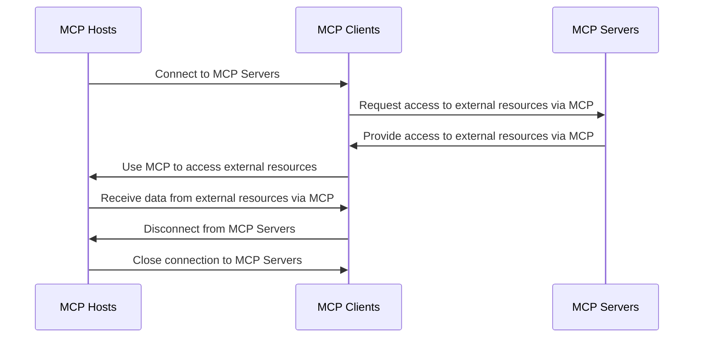

```mermaid
sequenceDiagram
    participant MCPHosts as MCP Hosts
    participant MCPClients as MCP Clients
    participant MCPServers as MCP Servers

    MCPHosts->>MCPClients: Connect to MCP Servers
    MCPClients->>MCPServers: Request access to external resources via MCP
    MCPServers->>MCPClients: Provide access to external resources via MCP

    MCPClients->>MCPHosts: Use MCP to access external resources
    MCPHosts->>MCPClients: Receive data from external resources via MCP

    MCPClients->>MCPHosts: Disconnect from MCP Servers
    MCPHosts->>MCPClients: Close connection to MCP Servers
```