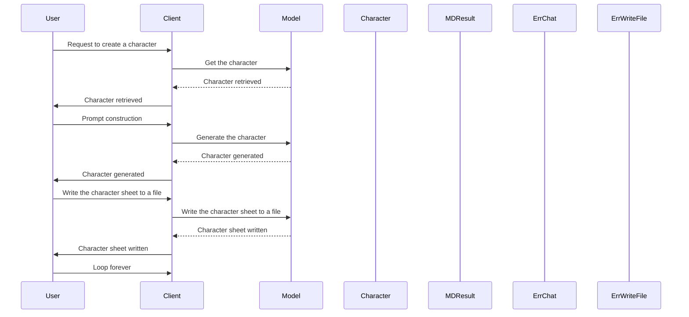

```mermaid
sequenceDiagram
    participant user as User
    participant client as Client
    participant model as Model
    participant character as Character
    participant mdResult as MDResult
    participant errChat as ErrChat
    participant errWriteFile as ErrWriteFile

    user->>client: Request to create a character
    client->>model: Get the character
    model-->>client: Character retrieved
    client->>user: Character retrieved
    user->>client: Prompt construction
    client->>model: Generate the character
    model-->>client: Character generated
    client->>user: Character generated
    user->>client: Write the character sheet to a file
    client->>model: Write the character sheet to a file
    model-->>client: Character sheet written
    client->>user: Character sheet written
    user->>client: Loop forever
```